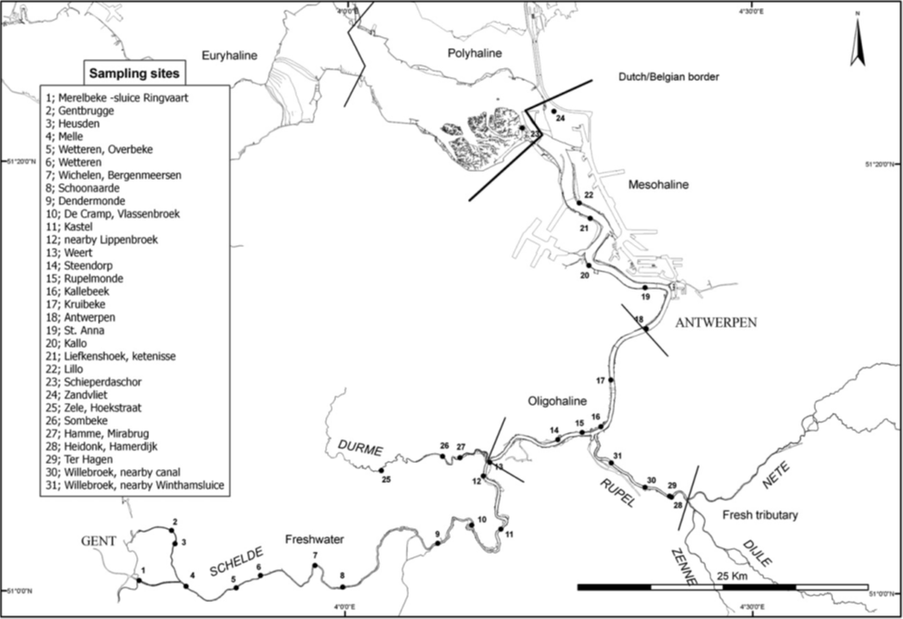

# Introduction

As rivers and waterbodies with different characteristics typically have a different fish diversity, different indexes are developed for different river typologies.
Before calculating an IBI or EQR, the typology of the sampling location should be determined to use the right index typology for the calculation.

The majority of the index typologies are freshwater rivers not under tidal influence, and these are characterised based on the width and slope.
They can easily be derived by using function `determine_indextypology()` and adding `index_type_code = "ZTWA"`.

For the Belgian estuaries under tidal influence, specific indexes are developed for different streams and salinity levels.
These indexes are described in the below chapters, which allows to know which index should be used where.

# Z-EBI- A zone-specific fish-based biotic index for the Zeeschelde estuary (Belgium)

A zone-specific fish-based multimetric estuarine index of biotic integrity (Z-EBI) was developed based on a 13 year time series of fish surveys (fykefishing) from the Zeeschelde estuary (Belgium) [@breine_zone-specific_2010].
The Z-EBI is defined by the average of the metric scores calculated over a one year period (3 seasons) and translated into an ecological quality ratio (EQR). The indices integrate structural and functional qualities of the estuarine fish communities.

the Zeeschelde (Belgium) consists of three salinity zones:

- the mesohaline zone (salinity: 5–18) between Zandvliet (Dutch–Belgian border) and Antwerpen,
- the oligohaline zone (salinity 0.5–5) between Antwerpen and Rupelmonde,including the Rupel River
- the freshwater zone between Rupelmonde and Gent, including the River Durme (limnetic zone: <0.5).

```{r, echo=FALSE, out.width="100%"}

```

For each salinity zone within the Zeeschelde estuary a list of candidate biological metrics was drawn based on ecological relevance. For instance, estuarine species are considered appropriate for the mesohaline zone but not for the freshwater zone, while diadromous species inhabit all zones. Each metric should describe a fish-relevant estuarine function, e.g. nursery function. 

3-indexes:

- the mesohaline zone: **fish-based estuarine Schelde mesohaline index**
- the oligohaline zone: **fish-based estuarine Schelde oligohaline index**
- the freshwater zone: **fish-based estuarine Schelde freshwater index**

# Fish-based index for freshwater tributaries of the Zeeschelde estuary that are under tidal influence

This index was developed for freshwater tributaries affected by tidal influences [@breine_visindex_2020]. The index is comprising four metrics. Metric values were calculated using data (fykefishing) obtained within one year (3 seasons).

# A fish-based biotic index for the IJzer estuary (Belgium)

The river IJzer originates in Kassel, France, and flows into the North Sea at Nieuwpoort via the Ganzepoot. The IJzer is 78 km long, 45 km of which lie within Belgian territory. The tidal section of the IJzer is approximately 3 km long and extends from the mouth of the river into the North Sea to the Ganzepoot lock complex. [@breine_het_2013]

# References
